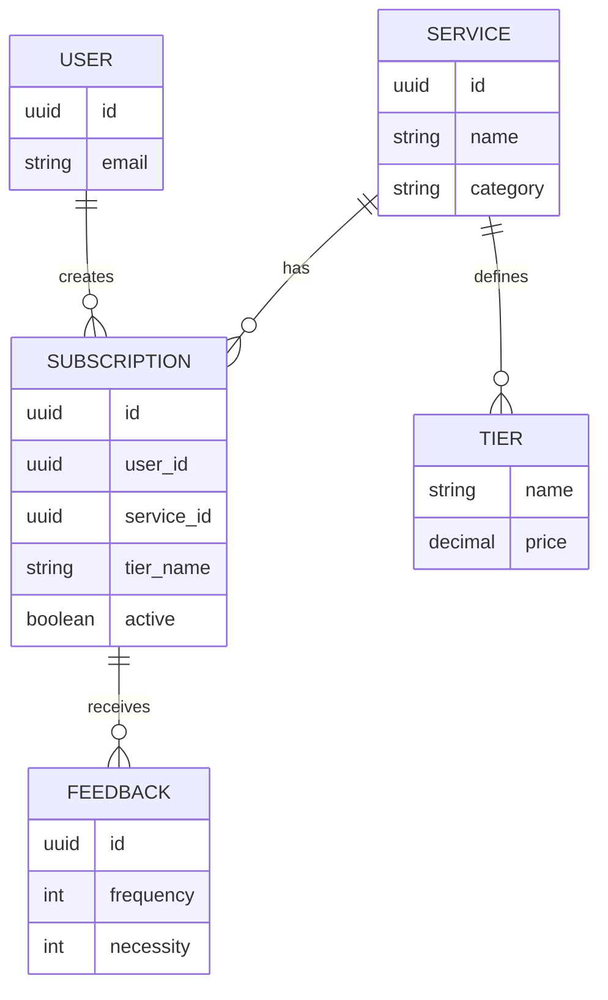

# База даних (Database)

Цей документ описує підходи до зберігання даних у системі SubOptima, режими роботи та структуру колекцій.

## 1. Режими зберігання даних

Система розроблена з підтримкою двох незалежних адаптерів бази даних, перемикання між якими відбувається через змінну середовища `STORAGE_TYPE` у файлі `.env`.

* **In-Memory (`STORAGE_TYPE=in_memory`):**
  * **Призначення:** Швидке локальне тестування, проходження CI/CD пайплайнів (GitHub Actions) без необхідності піднімати реальний сервер бази даних.
  * **Особливості:** Дані зберігаються у звичайних словниках (dictionaries) Python. При перезапуску сервера всі дані втрачаються. При старті спрацьовує `DataSeeder`, який автоматично наповнює сховище тестовими користувачами та каталогом із 16 сервісів.

* **MongoDB (`STORAGE_TYPE=mongodb`):**
  * **Призначення:** Продакшен-середовище та постійне зберігання даних.
  * **Особливості:** Використовує синхронний драйвер `pymongo` (або `mongomock` для тестів). Усі ідентифікатори (UUID) та дати автоматично серіалізуються у рядки перед збереженням через `model_dump(mode='json')` від Pydantic.

## 2. Модель предметної області (Domain Model)

Нижче наведено ER-діаграму, яка демонструє зв'язки між основними сутностями нашої бази даних.

## 3. Опис колекцій MongoDB
У режимі MongoDB система створює базу даних suboptima_db, яка містить чотири основні колекції:

## Колекція users
Зберігає профілі користувачів.

- id (String): Унікальний ідентифікатор користувача (UUIDv4 у вигляді рядка).

- email (String): Електронна пошта користувача.

- preferences (Object): Словник для зберігання налаштувань (наразі порожній).

## Колекція services
Містить статичний каталог доступних сервісів.

- id (String): Унікальний ідентифікатор сервісу.

- name (String): Назва сервісу (наприклад, "Netflix", "Spotify").

- category (String): Категорія (streaming, cloud, gaming, education).

- tiers (Array of Objects): Список доступних тарифів. Кожен об'єкт містить:

- name (String): Назва тарифу (наприклад, "Premium").

- price (Decimal/Float): Вартість за місяць у доларах.

## Колекція subscriptions
Фіксує активні та скасовані підписки користувачів.

- id (String): Унікальний ID запису.

- user_id (String): Посилання на користувача (FK).

- service_id (String): Посилання на сервіс (FK).

- tier_name (String): Обраний тарифний план.

- start_date (String): Дата оформлення підписки (ISO 8601).

- active (Boolean): Статус підписки (True/False).

## Колекція feedbacks
Зберігає щомісячні оцінки користувачів для кожної підписки (для нечіткої логіки).

- id (String): Унікальний ID відгуку.

- user_subscription_id (String): Посилання на конкретну підписку (FK).

- month_year (String): Місяць та рік у форматі YYYY-MM.

- frequency_1_to_7 (Int): Оцінка частоти використання (1-7).

- necessity_1_to_5 (Int): Оцінка критичності сервісу (1-5).